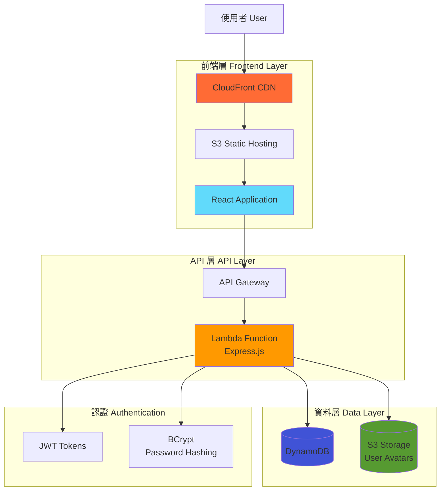
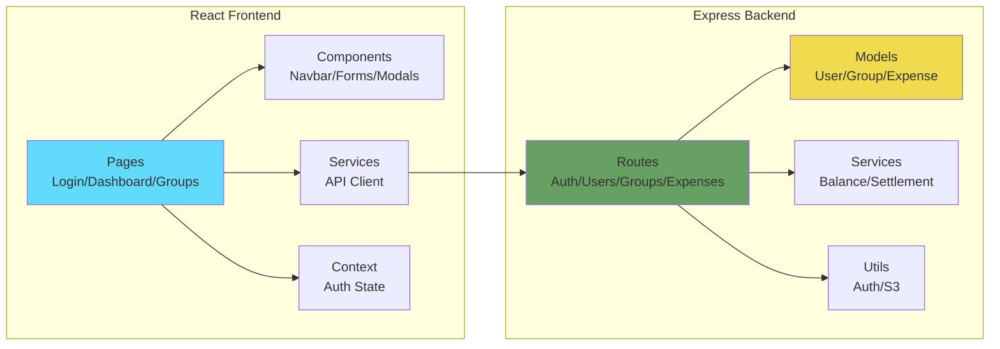
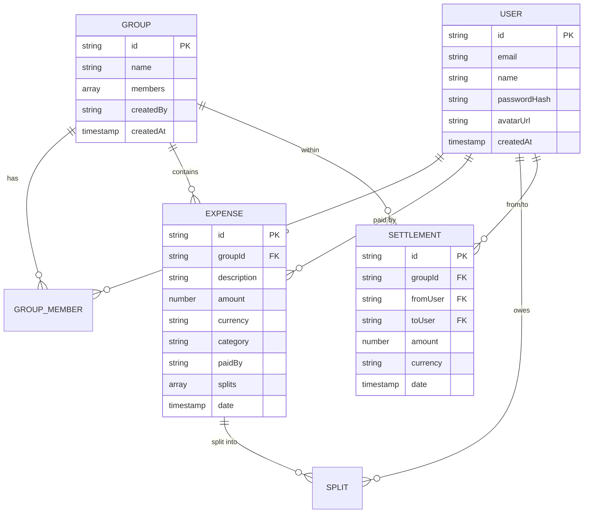
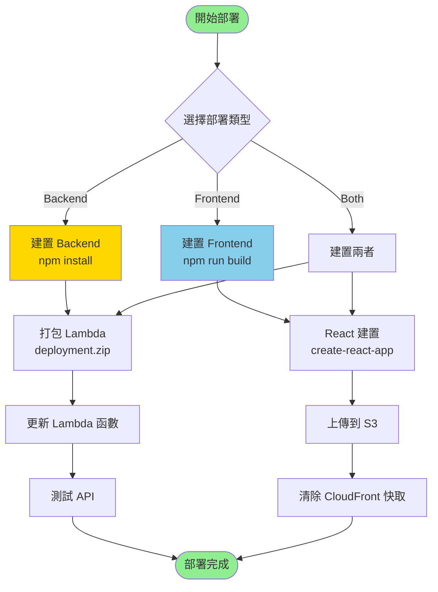

# SplitX Application

A full-stack application for splitting expenses among friends and groups.

## 專案架構 (Project Architecture)

### 系統架構圖 (System Architecture)



### 應用程式架構 (Application Architecture)



### 資料模型關係 (Data Model Relationships)



### 部署流程 (Deployment Flow)




## Deployment Instructions

We've consolidated all deployment scripts into a single `deploy-all.sh` script that can handle both backend and frontend deployments.
### Using the Unified Deployment Script

```bash
# Make the script executable if needed
chmod +x deploy-all.sh

# Run the deployment script
./deploy-all.sh [environment]
```

The script will prompt you to choose what you want to deploy:
1. Backend only
2. Frontend only
3. Both backend and frontend
4. Just invalidate CloudFront cache

### Environment Options

- `dev` (default): Development environment
- `staging`: Staging environment
- `prod`: Production environment

Example:
```bash
# Deploy to development environment (default)
./deploy-all.sh

# Deploy to production environment
./deploy-all.sh prod
```

## Application URLs

After deployment, your application will be available at:

- **API URL**: https://xro5pxx6oi.execute-api.us-west-2.amazonaws.com/dev
- **S3 Website**: http://expense-splitter-frontend-224425919845.s3-website-us-west-2.amazonaws.com
- **CloudFront URL (HTTPS)**: https://dwt4ijd80bt6i.cloudfront.net

## Recent Changes

- Fixed issue with edit expense button not showing for all users
- Consolidated deployment scripts into a single unified script
- Updated CloudFront distribution to point to the correct S3 bucket
- Added proper bucket policies for public access

## Troubleshooting

If you encounter issues with the CloudFront distribution showing stale content:
1. Run the deployment script and choose option 4 to invalidate the CloudFront cache
2. Wait 5-15 minutes for the changes to propagate through the CloudFront network
3. Try accessing the site in an incognito/private browsing window or clear your browser cache

For any other issues, check the CloudWatch logs for the Lambda function or contact support.
