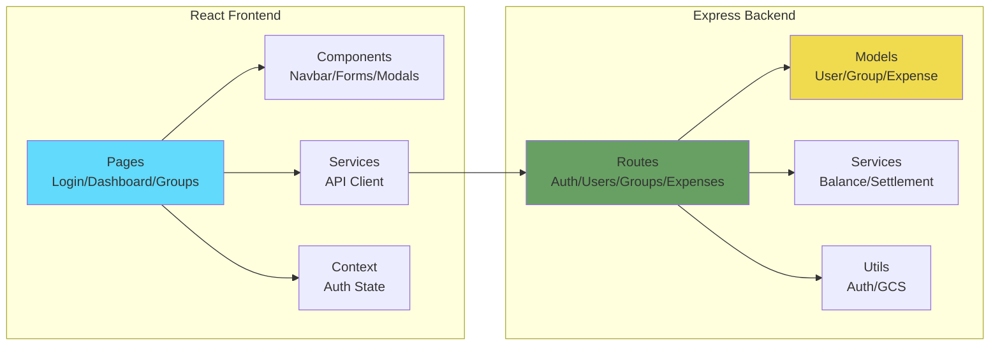
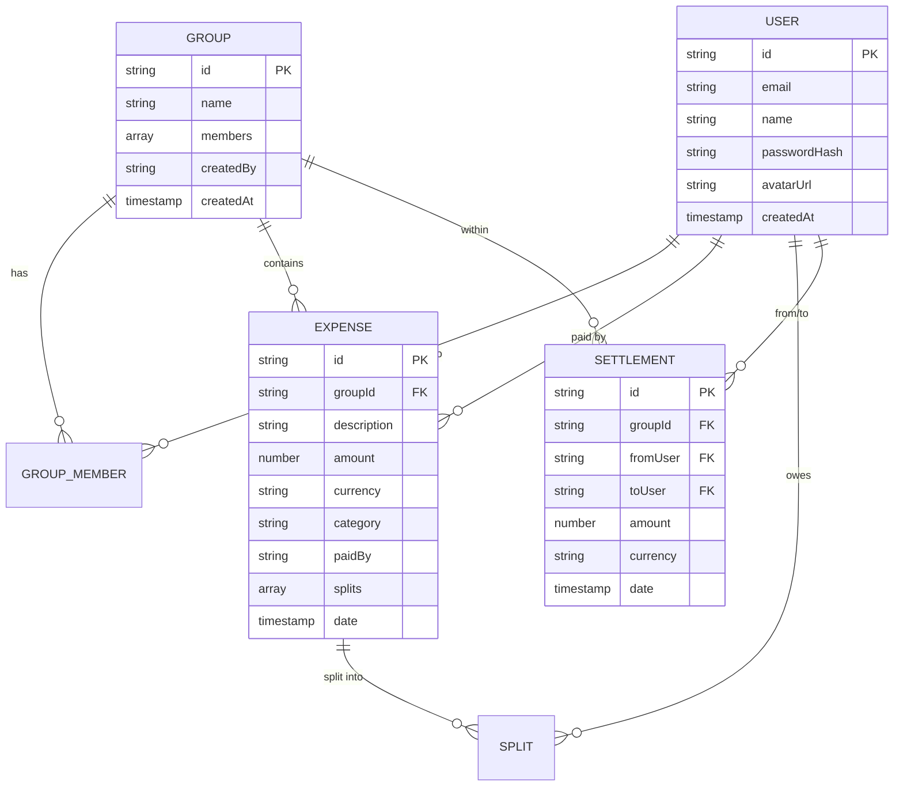

# SplitX Application

A full-stack application for splitting expenses among friends and groups, deployed on Google Cloud Platform.

## Live URL

- **Frontend**: https://splitx-tw.web.app
- **API**: https://expense-splitter-6vjteiok3q-de.a.run.app

## 系統架構 (System Architecture)

```
                       使用者
                      ┌──┴──┐
                 前端  │     │  API
                      ▼     ▼
            ┌─────────────┐ ┌──────────────────────┐
            │  Firebase    │ │  Cloud Run           │
            │  Hosting     │ │  asia-east1          │
            │              │ │                      │
            │  React SPA   │ │  Express.js (Node 22)│
            │  splitx-tw   │ │  Container, 0→10     │
            │  .web.app    │ │  512MB, 1 vCPU       │
            └─────────────┘ └──────┬──────┬────────┘
                                   │      │
                                   ▼      ▼
                     ┌──────────────┐ ┌──────────────┐
                     │  Firestore   │ │ Cloud Storage │
                     │  Native mode │ │ Photos Bucket │
                     │  asia-east1  │ │ (Public Read) │
                     └──────────────┘ └──────────────┘
```

## 技術棧 (Tech Stack)

| Layer | Technology |
|---|---|
| Frontend | React 18, React Router, Chart.js, Axios |
| Backend | Node.js 22, Express.js |
| Database | Google Cloud Firestore (Native mode) |
| Storage | Google Cloud Storage |
| Hosting | Firebase Hosting (frontend), Cloud Run (API) |
| IaC | Terraform |
| Auth | JWT + bcrypt |
| Secrets | Google Secret Manager |

## 應用程式架構 (Application Architecture)


```mermaid
graph LR
    subgraph "React Frontend"
        Pages[Pages<br/>Login/Dashboard/Groups]
        Components[Components<br/>Navbar/Forms/Modals]
        Services[Services<br/>API Client]
        Context[Context<br/>Auth State]
    end
    
    subgraph "Express Backend"
        Routes[Routes<br/>Auth/Users/Groups/Expenses]
        Models[Models<br/>User/Group/Expense]
        ServicesB[Services<br/>Balance/Settlement]
        Utils[Utils<br/>Auth/GCS]
    end
    
    Pages --> Components
    Pages --> Services
    Pages --> Context
    Services --> Routes
    Routes --> Models
    Routes --> ServicesB
    Routes --> Utils
    
    style Pages fill:#61dafb
    style Routes fill:#68a063
    style Models fill:#f0db4f
```

## 資料模型 (Data Model)


```mermaid
erDiagram
    USER ||--o{ GROUP_MEMBER : "belongs to"
    GROUP ||--o{ GROUP_MEMBER : "has"
    GROUP ||--o{ EXPENSE : "contains"
    USER ||--o{ EXPENSE : "paid by"
    EXPENSE ||--o{ SPLIT : "split into"
    USER ||--o{ SPLIT : "owes"
    USER ||--o{ SETTLEMENT : "from/to"
    GROUP ||--o{ SETTLEMENT : "within"
    
    USER {
        string id PK
        string email
        string name
        string passwordHash
        string avatarUrl
        timestamp createdAt
    }
    
    GROUP {
        string id PK
        string name
        array members
        string createdBy
        timestamp createdAt
    }
    
    EXPENSE {
        string id PK
        string groupId FK
        string description
        number amount
        string currency
        string category
        string paidBy
        array splits
        timestamp date
    }
    
    SETTLEMENT {
        string id PK
        string groupId FK
        string fromUser FK
        string toUser FK
        number amount
        string currency
        timestamp date
    }
```

## 專案結構 (Project Structure)

```
expense_splitter/
├── src/                    # Backend (Express.js)
│   ├── app.js              # Express server
│   ├── config/
│   │   └── firestore.js    # Firestore client
│   ├── models/             # User, Group, Expense, Settlement
│   ├── routes/             # API endpoints
│   ├── services/           # Balance & settlement logic
│   └── utils/              # Auth middleware, GCS service
├── frontend/               # React SPA
│   ├── src/
│   │   ├── pages/          # Login, Dashboard, Groups, Reports
│   │   ├── components/     # Reusable UI components
│   │   ├── services/       # API client (Axios)
│   │   └── contexts/       # Auth context
│   └── package.json
├── terraform/              # Infrastructure as Code
│   ├── main.tf             # Provider + GCP APIs
│   ├── cloud_run.tf        # Cloud Run + Artifact Registry + Secrets
│   ├── firestore.tf        # Firestore DB + indexes
│   ├── storage.tf          # Cloud Storage buckets
│   ├── iam.tf              # Service account + roles
│   ├── variables.tf        # project_id, region, jwt_secret
│   └── outputs.tf          # URLs
├── scripts/
│   └── migrate-dynamodb-to-firestore.js  # Data migration tool
├── Dockerfile              # Cloud Run container
├── firebase.json           # Firebase Hosting config
└── GCP-DEPLOYMENT.md       # Detailed deployment guide
```

## 本地開發 (Local Development)

```bash
# Backend
cp .env.example .env        # Fill in GCP credentials
npm install
npm run dev                  # http://localhost:3000

# Frontend
cd frontend
npm install
npm start                    # http://localhost:3001 (proxy to :3000)
```

## 部署 (Deployment)

詳細部署步驟請參考 [GCP-DEPLOYMENT.md](./GCP-DEPLOYMENT.md)。

快速部署流程：

```bash
# 1. 基礎設施
cd terraform && terraform apply -var="project_id=bucky-day-1" -var="jwt_secret=..."

# 2. Backend (Cloud Build)
gcloud builds submit --tag asia-east1-docker.pkg.dev/bucky-day-1/expense-splitter/api:latest --region=asia-east1

# 3. Frontend (Firebase)
cd frontend && REACT_APP_API_URL=$(terraform -chdir=../terraform output -raw api_url) npm run build
cd .. && firebase deploy --only hosting
```

## API Endpoints

| Method | Path | Description |
|---|---|---|
| POST | `/api/auth/register` | Register |
| POST | `/api/auth/login` | Login |
| GET | `/api/users/profile` | Get profile |
| PUT | `/api/users/profile` | Update profile |
| GET/POST | `/api/groups` | List / Create groups |
| GET/PUT/DELETE | `/api/groups/:id` | Group CRUD |
| POST | `/api/groups/:id/members` | Add member |
| GET/POST | `/api/expenses` | List / Create expenses |
| GET/PUT/DELETE | `/api/expenses/:id` | Expense CRUD |
| GET/POST | `/api/settlements` | List / Create settlements |
| GET | `/api/balances` | Get balances |
| GET | `/api/reports/monthly/:year/:month` | Monthly report |
| GET | `/health` | Health check |
